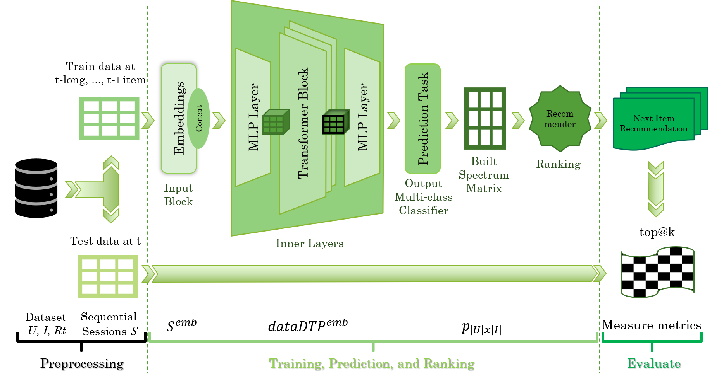

# X-Model4Rec Recommender
An efficient and less complex recommender model for managing sequential session-based recommendations, with a focus on the wine domain.
It's an extensible model to explore the user's dynamic taste profile using an architecture with multi-head attention and transformer mechanisms.

This will help other researchers to obtain the world wine dataset and replicate your experiments.

### Collaborative Platform and X-Wines Dataset for wider free use [(go now)](https://sites.google.com/farroupilha.ifrs.edu.br/xwines):

X-Wines is an academic work with scientific relevance in the computing area that is interconnected with other areas of knowledge. Please, access the <b>collaborative platform</b> and have fun among the wines experience: <a href="https://sites.google.com/farroupilha.ifrs.edu.br/xwines" target="_blank">https://sites.google.com/farroupilha.ifrs.edu.br/xwines</a>. 
* Navigate a free web platform without advertisements or any product sales. Know more about wines, their characteristics, elaboration, grape varieties, food pairings, wineries, producing regions, and more.
* Find your favorite or innovative wines! There are 100,646 wine labels, 21 million ratings, 30,510 wineries, 2,160 producing regions in 62 different countries around the world.

Contact: 
Prof. Rogério Xavier de Azambuja 
rogerio.xavier[at]farroupilha.ifrs.edu.br

IFRS-Instituto Federal de Educação, Ciência e Tecnologia do Rio Grande do Sul (<a href='https://www.ifrs.edu.br' target='_blank'>www.ifrs.edu.br</a>) 
UTAD-Universidade de Trás-os-Montes e Alto Douro/ECT-Escola de Ciências e Tecnologia (<a href='https://www.utad.pt' target='_blank'>www.utad.pt</a>)  
UAb-Universidade Aberta/DCeT-Departamento de Ciências e Tecnologias (<a href='https://www.uab.pt' target='_blank'>www.uab.pt</a>) 
